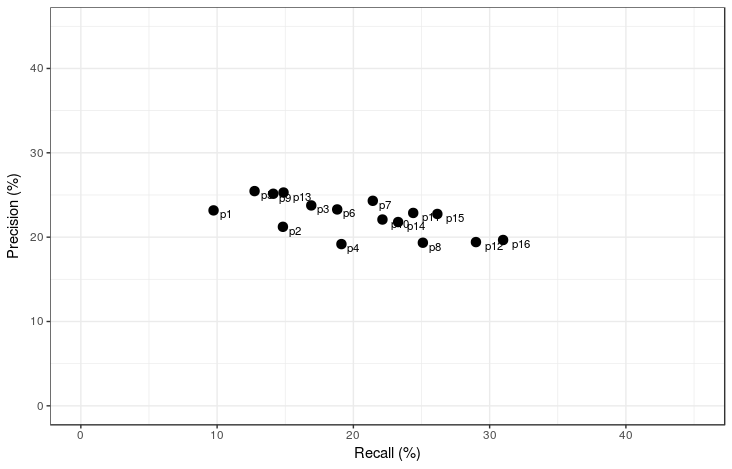

## Context

The program is made in R, since i had a short time to accomplish the task and i had to check the experiments faster. I do program in python eventually, using packages as pandas, numpy and scikit, but i am usually more adapted to R.  

The logic in the recommender system is user-based. As i didn't have past experiences with recommender system and so large volume of data, i developed some strategy that allowed me to develop a fast solution and consuming only a small sample of this large data.  

## The Recommender System

So, the logic is track a fraction of users which has at least a meaningful number of views, the meaningful is decided by the param `dummmy_thrs_views`. These users are called "dummy_users". For each dummer user is traced a profile of features. These profiles form a database called `dummy_profiles`.  

When it's requested to recomend a product to an active user, it is traced a profile for this user based on its past experiences. The profile will be compared to the dummy profiles, computing a empirical distance metric to decide which dummy is more similar to the active user.  

After the choice of the representative dummy is done, it's get the set of the dummy past product views. From this set of products are chosen the ones with the price closer of the active user profile.  

### The Data

To traning the dummy database is used a 500k sample of views from the days `2017-12-05` and `2017-12-06`. To test is used the transactions of the day `2017-12-07`, filtering this transaction only for user shown in the training day and limiting the amount to 1000 unique users.  

So, the system validation is get information from the two last days and check if the recommendation would have some effect in the following day.  

### Features Engineering

The features are created based on the past experiences presented in the dataset, and they are:
  * **Period:** the period which happened the view in the site, based on the time which the user is acessing the site, there are 4 possible periods: {late night - 0 to 5pm, morning - 6 to 11am, afternoon - 1 to 5pm , night - 6 to 11pm}. In the dataset we have a set of period accesses, the feature is the median of the period distribution.  
  * **Price:** it is the median of distribution of *log2* of prices viewed by the user. The log function is used to transform the price value to a *region of prices*. The *log2* was chosen because it seemed to work better than *ln* or *log10*.  
  * **Views:** it is the number of views that the user had had.  

**Observations:** 
1. From now and on, when i am referring to price, it's the transformed price: *log2(price)*.

### The Training

The training is to mount the best dummy database as possible. It is used only two free variable to manipulate the database, the number of dummy users and the threshold of price difference.  

The final model is kind of a KNN - for K=1 -, which the active user desires are suposed based on the most similar dummy user. To measure the similarity is used a heuristic distance computation:

#### Distance Computation

```
dist = 0.6*price_norm_diff + 0.2*period_norm_diff + 0.2*views_norm_diff
```
price_diff_norm = (price_user_active - price_closer_popular_user)/price_range   
period_diff_norm = (period_user_active - period_closer_popular_user)/period_range  
views_diff_norm = (views_user_active - views_closer_popular_user)/views_range  

**Observations:** 
1. *price_range* the the amplitude of the range found in the dataset of product's price. The other ranges are analogous.


### Evaluation

The evaluation was done in the transactions information, where was colected only the information of the day `2017-12-07`, and only the subset of users already present in the training data. Afterwards, because of the volume of users and running replication to test params, it was only selected 1000 randomly users to performance measurement.  

The measure wasn't precise over the specific user recommendation and what it bought, but it was over the whole group selected. For each user it was done a personalize recommendation, and in the end i check if these recommendations were bought by anyone of the users group in the transaction historical. This performance measurement adjust was needed in order of the large mass of the data is formed by users that appeared only once, also the products_id appeared only once.  

Precision was computed as: over all recommendations from the group, how many appeared in the transaction testset. And Recall was the inverse question, over all transaction testset how many are presents in the recommendations. The choice of the best parameters was done using the F-score.  

This performance situation wasn't exactly a tradeoff, but the figure of the values accomplished follows bellow:  




